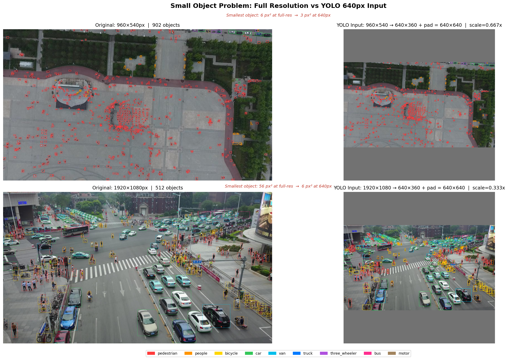
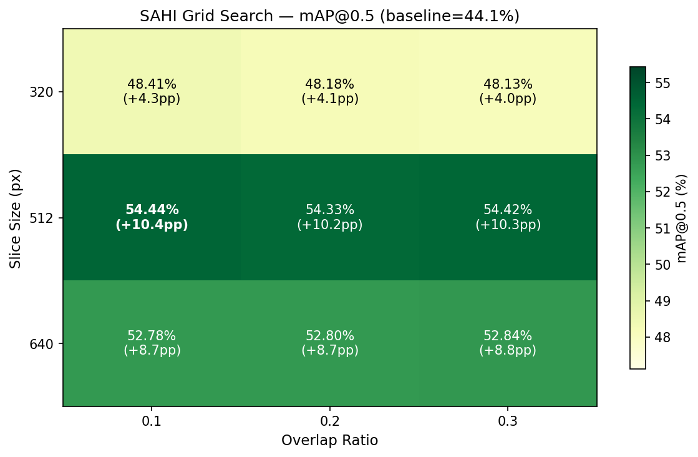
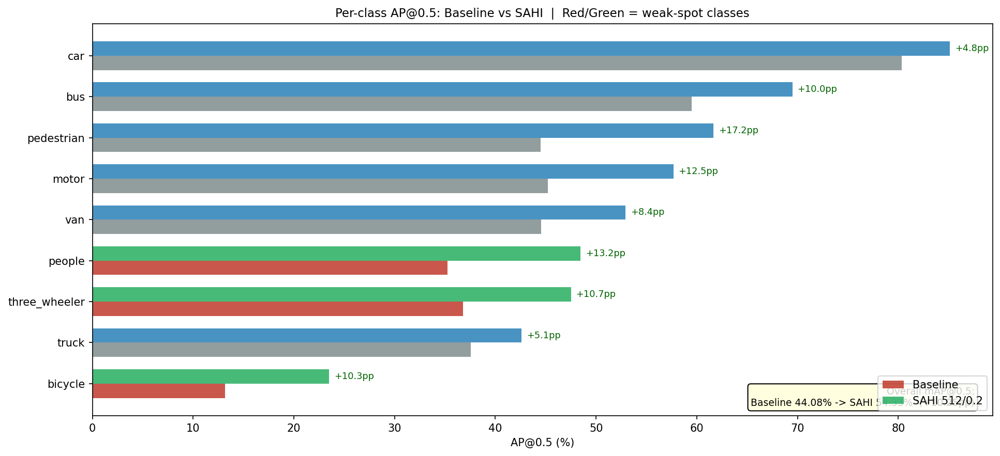
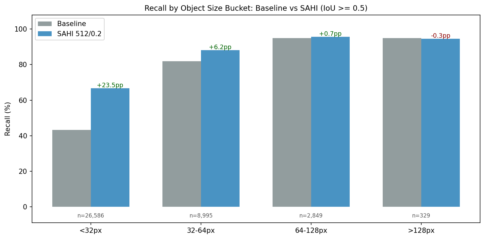

[](https://github.com/YasinduKaveesha/deep-learning-projects/actions/workflows/ci.yml)
[](https://huggingface.co/spaces/mykkularathne/aerovision-lk)

# AeroVision LK

Aerial vehicle detection for Sri Lankan urban traffic — YOLOv8 + SAHI on VisDrone2019-DET with INT8 quantization for edge deployment.

**[Live Demo](https://huggingface.co/spaces/mykkularathne/aerovision-lk)**

---

## The Problem

Standard YOLO resizes every input image to 640×640 pixels before inference. VisDrone drone frames range from 960×540 to 2000×1500. After resize, a pedestrian that was 18px wide becomes a 6px blob — below the network's effective feature-extraction threshold.

**78.7% of all 343,205 training annotations are smaller than 50×50 pixels.** The model never sees them.

<p align="center">
  
</p>

## The Solution — SAHI (Slicing Aided Hyper Inference)

Instead of resizing the whole image, SAHI slices it into overlapping 512×512 tiles and runs YOLO on each tile at full resolution. Detections from all tiles are merged using Non-Maximum Suppression. Small objects are never downscaled — they are always seen at their original pixel size.

**Result: 54.44% mAP@0.5** — a **+10.36 percentage point** improvement over the 44.08% baseline.

## Results

| Variant | mAP@0.5 | mAP@0.5:0.95 | Latency | Device | Model Size |
|:---|:---:|:---:|:---:|:---:|:---:|
| YOLOv8s Baseline | 44.08% | 26.09% | 112.7 ms | GPU | 21.5 MB |
| YOLOv8s + SAHI 512/0.1 | **54.44%** | **32.98%** | 206.1 ms | GPU | 21.5 MB |
| YOLOv8s INT8 (no SAHI) | 51.58% | 33.42% | 94.7 ms | CPU | 11.0 MB |
| YOLOv8s + SAHI + INT8 | 54.07% | 32.76% | 858.4 ms | CPU | **11.0 MB** |

INT8 dynamic quantization achieves a **3.9× model size reduction** (21.5 MB → 11.0 MB) while preserving 99.3% of SAHI mAP.

## SAHI Grid Search

9 configurations tested: slice size {320, 512, 640} × overlap ratio {0.1, 0.2, 0.3}.

Best configuration: **slice 512, overlap 0.1** — highest mAP@0.5 (54.44%) at the lowest latency among 512-tile configs (206.1 ms/img).

<p align="center">
  
</p>

## Per-Class Improvement

AP@0.5 on VisDrone2019-DET val (548 images). Baseline → SAHI best config (512/0.1).

| Class | Baseline | SAHI | Delta |
|:---|:---:|:---:|:---:|
| pedestrian | 44.5% | 62.0% | **+17.5pp** |
| people | 35.2% | 48.7% | +13.4pp |
| bicycle | 13.2% | 23.3% | +10.1pp |
| car | 80.3% | 85.1% | +4.8pp |
| van | 44.5% | 53.2% | +8.7pp |
| truck | 37.5% | 42.5% | +4.9pp |
| three_wheeler | 36.8% | 47.8% | +11.0pp |
| bus | 59.5% | 69.7% | +10.3pp |
| motor | 45.2% | 57.6% | +12.4pp |

Every class improves. The largest gains are on the smallest object classes (pedestrian, people, motor).

<p align="center">
  
</p>

## Small Object Recall

Recall by ground-truth bounding box size bucket:

| Size Bucket | Ground Truths | Baseline Recall | SAHI Recall | Delta |
|:---|:---:|:---:|:---:|:---:|
| < 32 px | 26,586 | 43.3% | 66.7% | **+23.5pp** |
| 32–64 px | 8,995 | 81.9% | 88.1% | +6.2pp |
| 64–128 px | 2,849 | 95.0% | 95.7% | +0.7pp |
| > 128 px | 329 | 94.8% | 94.5% | -0.3pp |

SAHI's gains are concentrated exactly where standard YOLO fails — objects under 32 pixels, which make up 68% of all ground truths.

<p align="center">
  
</p>

## Three-Wheeler Detection — Sri Lanka Context

VisDrone's "tricycle" class maps directly to Sri Lankan three-wheelers (tuk-tuks). This is not data manipulation — it is intelligent localization of a global benchmark to a local deployment context.

Three-wheelers are the dominant mode of urban transport in Sri Lanka. Detecting them reliably from aerial footage is a prerequisite for any drone-based traffic monitoring system deployed locally.

- **Baseline AP@0.5:** 36.8%
- **SAHI AP@0.5:** 47.8% (+11.0pp)
- **Training samples:** 8,058 (2.35% of dataset — a rare class)

## How to Run

**Local API server:**

```bash
pip install -r requirements.txt
uvicorn app.main:app --port 8000
```

Endpoints:
- `GET /health` — model status
- `GET /classes` — list of 9 detection classes
- `POST /predict` — upload an image, get detections

**Docker:**

```bash
docker build -t aerovision-lk .
docker run -p 8000:8000 aerovision-lk
```

**Gradio demo:**

```bash
python app/gradio_demo.py
# Opens at http://127.0.0.1:7860
```

Side-by-side comparison of SAHI vs standard YOLO inference with bounding box visualization.

## Failure Analysis

The model still struggles in specific areas:

- **Bicycle** remains the weakest class at 23.3% AP@0.5 even after SAHI. Only 10,480 training samples (3.05% of dataset) — a class imbalance problem, not an inference problem.
- **People vs pedestrian confusion** — these two classes overlap semantically (people sitting vs standing/walking), causing cross-class false positives. People AP tops out at 48.7%.
- **Extreme density scenes** (300+ objects per frame) still produce missed detections near tile boundaries, even with 10% overlap.
- **Night and low-contrast conditions** — VisDrone includes dusk/dawn scenes where small dark vehicles blend into shadows.

<p align="center">
  
</p>

## Project Structure

```
aerovision_lk/
├── app/
│   ├── main.py                 # FastAPI inference server
│   ├── model.py                # SAHI + ONNX INT8 model manager
│   ├── schemas.py              # Pydantic response models
│   ├── gradio_demo.py          # HuggingFace Spaces demo
│   └── examples/               # Sample VisDrone val images
├── research/
│   ├── 01_eda.ipynb            # Exploratory data analysis
│   ├── 02_baseline_yolov8.ipynb # YOLOv8s training + evaluation
│   ├── 03_sahi_inference.ipynb  # SAHI integration + recall analysis
│   ├── 04_sahi_experiments.ipynb # Grid search over SAHI configs
│   └── 05_quantization.ipynb    # ONNX export + INT8 quantization
├── analysis/                    # Metrics CSVs (all experiments logged)
├── reports/figures/             # All plots and visualizations
├── tests/                       # API unit tests (pytest)
├── weights/                     # Model weights (not tracked in git)
├── Dockerfile                   # CPU-optimized container
├── .github/workflows/ci.yml    # Lint (ruff) + test on push
├── requirements.txt
├── requirements-docker.txt      # CPU-only PyTorch for Docker
└── requirements_spaces.txt      # HuggingFace Spaces dependencies
```

---

**AeroVision LK** — Built YOLOv8 + SAHI aerial detection pipeline achieving 54.4% mAP@0.5 (+10.4pp over baseline) on VisDrone2019-DET, with INT8 quantization (3.9x size reduction) and FastAPI/Docker deployment.
