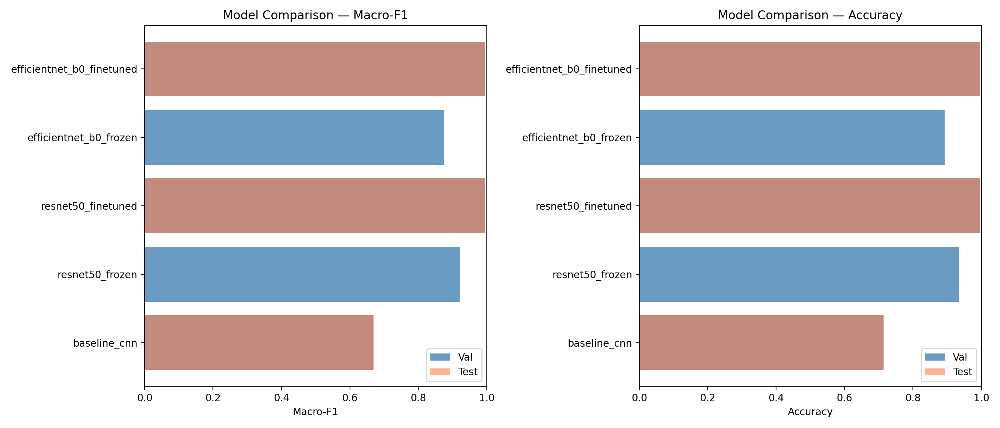

[](https://github.com/YasinduKaveesha/deep-learning-projects/actions/workflows/ci.yml)
[](https://huggingface.co/spaces/mykkularathne/plant-disease-classification)

# Plant Disease Classification

Deep learning pipeline for classifying 38 plant disease categories from leaf images. Trained on the PlantVillage dataset using a custom baseline CNN and two pretrained architectures (ResNet50, EfficientNet-B0) with two-stage transfer learning.

**[Try the live demo on HuggingFace Spaces](https://huggingface.co/spaces/mykkularathne/plant-disease-classification)**

---

## The Problem

Identifying plant diseases from leaf images is critical for early intervention in agriculture. Manual inspection is slow and requires expert knowledge. A reliable automated classifier can help farmers diagnose diseases from a simple phone photo.

**Dataset:** PlantVillage — 54,305 images across 38 classes (diseases + healthy variants across 14 crop species), with up to 36x class imbalance.

## The Solution — Transfer Learning with Two-Stage Fine-Tuning

Rather than training from scratch, we leverage ImageNet-pretrained backbones and fine-tune in two stages:

- **Stage 1 — Frozen (10 epochs, lr=1e-3):** Backbone frozen, only the classifier head trains
- **Stage 2 — Fine-tune (20 epochs, lr=1e-4, CosineAnnealingLR):** All layers unfrozen for full adaptation

**Result: 99.66% test accuracy** with ResNet50 — only 28 misclassifications out of 8,146 test images.

---

## Results

### Model Comparison

| Model | Val Accuracy | Val Macro-F1 | Test Accuracy | Test Macro-F1 |
|:---|:---:|:---:|:---:|:---:|
| Baseline CNN | 71.38% | 0.6668 | 71.37% | 0.6715 |
| ResNet50 (frozen) | 93.46% | 0.9214 | — | — |
| ResNet50 (fine-tuned) | 99.69% | 0.9953 | **99.66%** | **0.9952** |
| EfficientNet-B0 (frozen) | 89.32% | 0.8757 | — | — |
| EfficientNet-B0 (fine-tuned) | 99.62% | 0.9948 | 99.63% | 0.9943 |

Test evaluation run on fine-tuned checkpoints only. Frozen rows show val metrics at end of Stage 1.

<p align="center">
  
</p>

### Error Analysis

- **Total misclassifications:** 28 of 8,146 test images (0.34%)
- **Primary failure mode:** Corn Cercospora leaf spot <-> Corn Northern Leaf Blight (9 of 28 errors, 32%) — both produce visually identical elongated stripe patterns; the model cannot distinguish lesion width or colour tone at 7x7 feature map resolution
- **Secondary failures:** Potato Late Blight -> Tomato Late Blight (2 errors, no host-plant context), Tomato Target Spot -> Tomato healthy (2 errors, early-stage lesions)

### Grad-CAM Findings

- **Layer:** `model.layer4[-1]` — ResNet50 last residual block, 7x7 spatial resolution
- **Correct predictions:** Activation concentrates tightly over lesion tissue (scab spots, mildew colonies, blight patches). Background shows near-zero activation.
- **Incorrect predictions:** Diffuse activation spread across the full leaf or on veins and edges rather than lesion tissue.
- **Verdict:** The model has learned genuine disease patterns, not background shortcuts. Remaining errors reflect fundamental visual similarity limits in the dataset.

---

## How to Run

### Local API server

```bash
pip install -r requirements.txt
uvicorn api.app:app --port 8000
```

Endpoints:
- `GET /health` — model status
- `POST /predict` — upload an image, get class + confidence + top-3

```bash
curl -X POST http://localhost:8000/predict \
  -F "file=@your_leaf.jpg"
```

Response:
```json
{
  "predicted_class": "Tomato___Late_blight",
  "confidence": 0.9987,
  "top3": [
    {"class": "Tomato___Late_blight", "confidence": 0.9987},
    {"class": "Potato___Late_blight", "confidence": 0.0008},
    {"class": "Tomato___Septoria_leaf_spot", "confidence": 0.0003}
  ],
  "inference_time_ms": 45.2
}
```

### Docker

```bash
docker build -t plant-disease-classifier .
docker run -p 8000:8000 plant-disease-classifier
curl http://localhost:8000/health
```

CPU-only image (~1.2 GB). Only `api/`, `models/`, and `data/processed/` are copied — no training code.

### Gradio demo

```bash
python app.py
# Opens at http://127.0.0.1:7860
```

### Training from scratch

```bash
pip install -r requirements.txt

# 1. Download PlantVillage from Kaggle and place under data/raw/
jupyter notebook notebooks/01_eda.ipynb          # EDA + stratified splits
jupyter notebook notebooks/02_baseline_cnn.ipynb  # Baseline CNN (10 epochs)
jupyter notebook notebooks/03_transfer_learning_experiments.ipynb  # ResNet50 + EfficientNet-B0
jupyter notebook notebooks/04_error_analysis_gradcam.ipynb        # Error analysis + Grad-CAM
```

Expected runtime on RTX 3050 6GB: ~5-7 hours total (ResNet50: ~3-4 hrs, EfficientNet-B0: ~2-3 hrs).

---

## Key Findings

1. **Transfer learning gap is decisive.** Fine-tuned ResNet50 (Macro-F1: 0.9952) outperforms the baseline CNN (0.6715) by +32.4 percentage points. Even a frozen ResNet50 head (0.9214) beats the fully-trained baseline by +25pp.

2. **Fine-tuning Stage 2 is worth it.** Stage 2 adds +7.4pp F1 over the frozen backbone for ResNet50 (0.9214 -> 0.9953), confirming that adapting deep convolutional filters to agricultural imagery is necessary to reach near-perfect performance.

3. **ResNet50 vs EfficientNet-B0.** ResNet50 wins by 0.09pp test Macro-F1 (0.9952 vs 0.9943) with 25.6M vs 5.3M parameters. EfficientNet-B0 is the better choice under strict size or latency constraints.

4. **Remaining errors are irreducible at this scale.** All 28 misclassifications involve classes with genuinely ambiguous visual boundaries. Grad-CAM confirms the model attends to lesion tissue on correct predictions — further improvement would require higher-resolution imaging or multi-scale feature fusion, not more training.

---

## Project Structure

```
02_plant_disease_classification/
├── notebooks/
│   ├── 01_eda.ipynb                           # EDA, class distribution, stratified splits
│   ├── 02_baseline_cnn.ipynb                  # Custom 3-block CNN, 10 epochs
│   ├── 03_transfer_learning_experiments.ipynb  # ResNet50 + EfficientNet-B0 two-stage training
│   └── 04_error_analysis_gradcam.ipynb         # Error analysis, confusion matrix, Grad-CAM
├── api/
│   └── app.py                                 # FastAPI — /health, /predict
├── models/                                     # Trained weights (not tracked in git)
├── data/processed/                             # Stratified CSV splits (70/15/15)
├── reports/figures/                            # Training curves, confusion matrices
├── spaces/                                    # HuggingFace Spaces deployment
│   ├── app.py                                 # Self-contained Gradio demo
│   └── examples/                              # Sample tomato leaf images
├── examples/                                  # Sample leaf images for local demo
├── app.py                                     # Gradio app (local / Spaces)
├── Dockerfile                                 # CPU-only container (~1.2 GB)
├── .github/workflows/ci.yml                   # Lint + test + Docker build on push
├── requirements.txt
└── README.md
```

---

## Tech Stack

| Category | Tools |
|----------|-------|
| Framework | PyTorch |
| Pretrained Models | ResNet50, EfficientNet-B0 (torchvision) |
| Explainability | Grad-CAM |
| API | FastAPI + Uvicorn |
| Demo | Gradio (HuggingFace Spaces) |
| Container | Docker |
| CI | GitHub Actions |
| Linting | ruff |
| Hardware | NVIDIA RTX 3050 6GB, mixed precision (AMP) |

