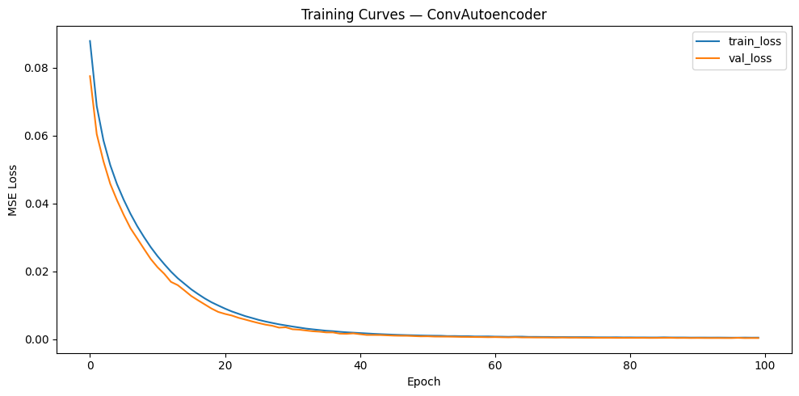
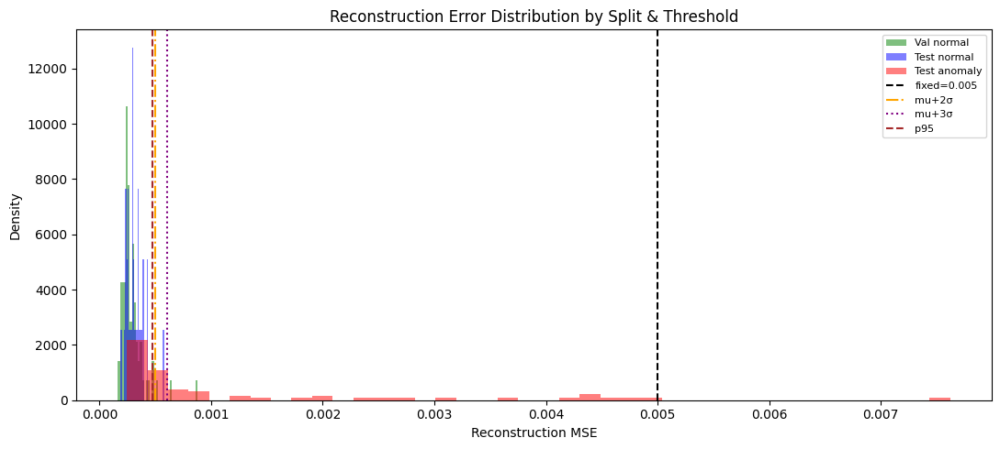
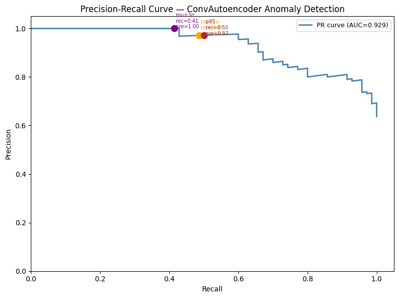
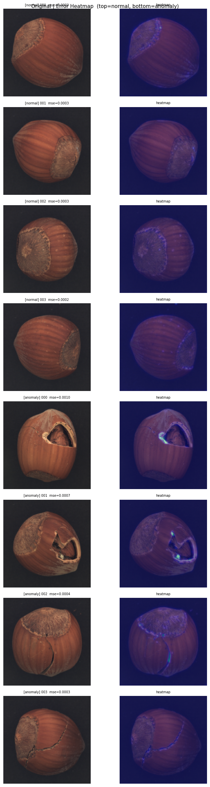

[](https://github.com/YasinduKaveesha/deep-learning-projects/actions/workflows/ci.yml)
[](https://huggingface.co/spaces/mykkularathne/autoencoder-anomaly-detection)

# Autoencoder Anomaly Detection

Unsupervised industrial surface defect detection using a convolutional autoencoder trained on the MVTec AD hazelnut dataset. The model learns to reconstruct defect-free images only — anomalies are flagged when reconstruction error exceeds a calibrated threshold.

**[Try the live demo on HuggingFace Spaces](https://huggingface.co/spaces/mykkularathne/autoencoder-anomaly-detection)**



---

## Architecture

```
Input (3×224×224)
    │
    ▼
┌─────────────────────────────────────┐
│  ENCODER                            │
│  Conv2d(  3→ 32, k3, s2)  224→112   │
│  Conv2d( 32→ 64, k3, s2)  112→ 56   │
│  Conv2d( 64→128, k3, s2)   56→ 28   │
│  Conv2d(128→256, k3, s2)   28→ 14   │
│  + BatchNorm + ReLU after each      │
└─────────────┬───────────────────────┘
              │
        Bottleneck (256×14×14)
              │
┌─────────────▼───────────────────────┐
│  DECODER                            │
│  ConvT(256→128, k3, s2)   14→ 28   │
│  ConvT(128→ 64, k3, s2)   28→ 56   │
│  ConvT( 64→ 32, k3, s2)   56→112   │
│  ConvT( 32→  3, k3, s2)  112→224   │
│  + BatchNorm + ReLU, final Sigmoid  │
└─────────────────────────────────────┘
    │
    ▼
Output (3×224×224) in [0, 1]
```

- **Parameters:** 777,987 (all trainable)
- **Loss:** MSE between Sigmoid output and denormalized input (both in [0,1])
- **Optimizer:** Adam, lr=1e-4
- **Training:** 100 epochs, batch 16, patience 10 (no early stop triggered)

---

## Dataset — MVTec AD Hazelnut

| Split | Total | Normal | Anomaly | Defect Types |
|-------|-------|--------|---------|-------------|
| Train | 312 | 312 | 0 | — |
| Val | 79 | 79 | 0 | — |
| Test | 110 | 40 | 70 | crack (18), cut (17), hole (18), print (17) |

Images resized to 256 → center-cropped to 224×224 → ImageNet-normalized.

---

## Results

### Training

| Metric | Value |
|--------|-------|
| Train loss (epoch 100) | 0.000423 |
| Best val loss (epoch 98) | 0.000289 |
| Val error μ | 0.000289 |
| Val error σ | 0.000104 |

### Threshold Comparison (test split)

| Strategy | Threshold | Precision | Recall | F1 | PR-AUC |
|----------|-----------|-----------|--------|----|--------|
| fixed | 0.005000 | 1.0000 | 0.0286 | 0.0556 | 0.9286 |
| μ+2σ | 0.000498 | 0.9706 | 0.4714 | 0.6346 | 0.9286 |
| μ+3σ | 0.000602 | 1.0000 | 0.4000 | 0.5714 | 0.9286 |
| **p95** | **0.000470** | **0.9714** | **0.4857** | **0.6476** | **0.9286** |

**Best: p95 threshold (F1=0.6476, Precision=97.1%, Recall=48.6%)**

**PR-AUC: 0.9286** — the model ranks anomalies very well regardless of threshold.

### Failure Analysis

The recall bottleneck (~49%) comes from subtle defect types, particularly `print` and shallow `crack` defects, where the per-pixel reconstruction error is close to the normal distribution. The autoencoder reconstructs these nearly as well as normal images because the defects don't significantly alter the global image structure.

Precision is near-perfect (97%+), meaning when the model flags an anomaly, it is almost always correct. The model is conservative — it misses some real defects but rarely raises false alarms.







---

## Project Structure

```
03_autoencoder-anomaly-detection/
├── app/
│   ├── main.py                         # FastAPI — /health, /predict
│   ├── model.py                        # Self-contained inference (no src/ imports)
│   ├── schemas.py                      # Pydantic request/response models
│   ├── gradio_demo.py                  # Gradio UI demo
│   └── examples/                       # 3 sample images for Gradio
├── notebooks/
│   ├── 01_eda.ipynb                    # EDA + dataset exploration
│   ├── 02_train_autoencoder.ipynb      # Training + MLflow tracking
│   ├── 03_evaluate_autoencoder.ipynb   # Threshold calibration + evaluation
│   └── 04_defect_analysis.ipynb        # Per-defect-type breakdown
├── src/
│   ├── dataset.py                      # MVTecDataset + DataLoader factory
│   ├── model.py                        # ConvAutoencoder architecture
│   ├── threshold.py                    # Threshold calibration + evaluation
│   ├── train.py                        # Training loop with MLflow
│   └── visualize.py                    # Error histograms, PR curves, heatmaps
├── tests/
│   └── test_api.py                     # 3 integration tests
├── models/
│   └── best_autoencoder.pt             # Trained checkpoint (epoch 98)
├── reports/
│   ├── eval_metrics.csv                # Threshold comparison table
│   └── figures/                        # 11 generated plots
├── spaces/
│   ├── app.py                          # Self-contained Gradio demo
│   ├── best_autoencoder.pt             # Model checkpoint for Spaces
│   └── examples/                       # Sample images
├── data/mvtec/hazelnut/                # MVTec AD dataset (not committed)
├── .github/workflows/ci.yml           # ruff + pytest on push
├── Dockerfile                          # CPU-only Python 3.11-slim
├── LICENSE
├── pyproject.toml
├── requirements.txt
└── README.md
```

---

## Run Locally

### Prerequisites

- Python 3.11+
- NVIDIA GPU with CUDA (optional, CPU works)
- MVTec AD hazelnut dataset in `data/mvtec/hazelnut/`

### Setup

```bash
conda create -n anomaly python=3.11 -y
conda activate anomaly
pip install -r requirements.txt
```

### Train

```bash
python -m src.train
# Logs to MLflow — run `mlflow ui` for the dashboard
```

### Evaluate

```bash
jupyter lab notebooks/03_evaluate_autoencoder.ipynb
# Or run all notebooks in order: 01 → 02 → 03
```

### FastAPI

```bash
uvicorn app.main:app --reload
# GET  http://localhost:8000/health
# POST http://localhost:8000/predict  {"image_base64": "<base64>"}
```

### Gradio Demo

```bash
python -m app.gradio_demo
# Opens at http://localhost:7860
```

### Tests

```bash
pytest tests/ -v
ruff check .
```

---

## Docker

```bash
docker build -t anomaly-detector .
docker run -p 8000:8000 anomaly-detector
curl http://localhost:8000/health
```

CPU-only image (~1.5 GB). Only `app/` and `models/` are copied — no training code or data.

---

## Tech Stack

| Category | Tools |
|----------|-------|
| Framework | PyTorch |
| Experiment Tracking | MLflow |
| API | FastAPI + Uvicorn |
| Demo | Gradio |
| Validation | Pydantic v2 |
| Testing | pytest |
| Linting | ruff |
| Container | Docker |
| CI | GitHub Actions |
| CV | OpenCV (heatmaps) |
| Data | scikit-learn, scikit-image |

